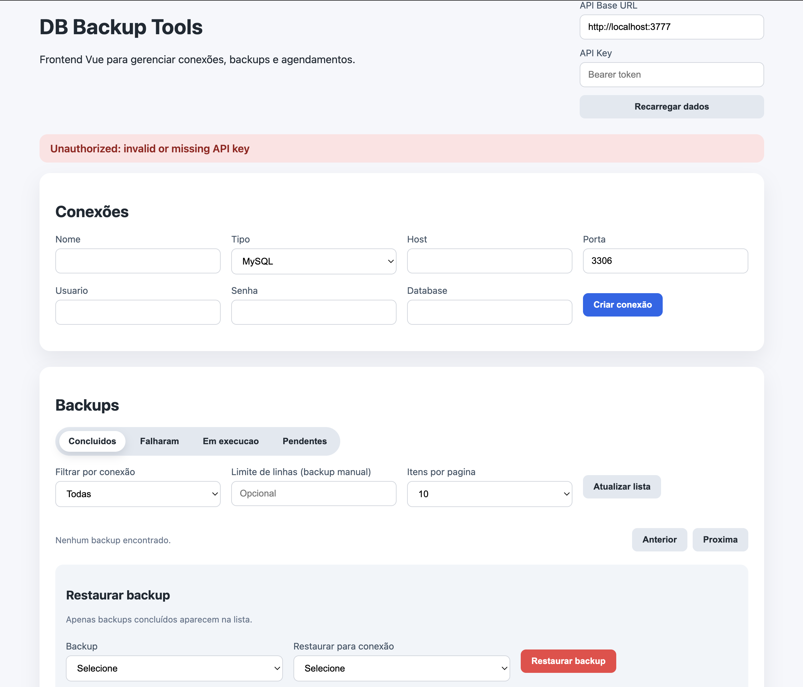

# DB Backup Tools

Ferramenta CLI + API REST para backup de bancos de dados com arquitetura extensível via Strategy Pattern. Suporta MySQL e PostgreSQL (via mysqldump e pg_dump) com armazenamento de configurações e histórico em SQLite. Senhas são criptografadas com AES-256-GCM para segurança. Agendamento de backups via cron expressions. API documentada e validada com Zod. CLI standalone para operações manuais.

Esse projeto usa uma abordagem customizada, leve e performática, uma vez que os comandos de dump são executados de forma nativa diretamente no sistema, sem overhead de bibliotecas ORM ou conexões persistentes.



## Quick Start

### Com Docker (recomendado)

```bash
cp .env.example .env    # configurar ENCRYPTION_KEY e API_KEY
docker compose up -d    # build + start na porta 3777
```

### Sem Docker

```bash
npm install

# Gerar chaves de segurança
npm run cli -- encryptionkey generate
npm run cli -- apikey generate

# Iniciar servidor API (porta 3777)
npm run dev

# Ou usar via CLI
npm run cli -- connections list
npm run cli -- backup run <connectionId>
npm run cli -- serve
```

## Frontend (Vue)

O frontend Vue usa a API existente e roda separado do servidor.

```bash
cd frontend
npm install
npm run dev
```

Abra `http://localhost:5173` e configure o **API Base URL** (ex: `http://localhost:3777`) e a **API Key**.

## Features

- Cadastro e gerenciamento de conexões de banco de dados
- Backup manual via API REST ou CLI
- Backup parcial com `--limit` (limitar número de linhas)
- Histórico de backups com download de arquivos
- Agendamento automático via cron expressions
- Arquitetura extensível com Strategy Pattern (fácil adicionar novos bancos)
- Storage em SQLite (robusto, queryable, sem dependência externa de servidor)
- Criptografia AES-256-GCM para senhas de conexão
- Migração automática de dados do JSON legado para SQLite
- Restore de backups para o banco original ou outro destino
- Sistema de storage conectavel (local ou S3/MinIO) via Strategy Pattern
- Autenticação via API Key (Bearer token ou X-API-Key) com proteção contra timing attacks
- Geração segura de API Key e ENCRYPTION_KEY via CLI
- API RESTful com validação Zod em todas as rotas
- CI automatizado via GitHub Actions (typecheck + testes + build)
- CLI standalone (funciona sem o servidor rodando)
- Logging de todas as requisições HTTP no servidor

## Bancos suportados

| Banco      | Status | Driver               |
|------------|--------|----------------------|
| MySQL      | OK     | `mysqldump`          |
| PostgreSQL | OK     | `pg_dump`            |
| MongoDB    | Futuro | `mongodump`          |

## Stack

- **Runtime:** Node.js 22+ com TypeScript
- **API:** Express.js
- **Storage de dados:** SQLite via better-sqlite3
- **Storage de backups:** Local (filesystem) ou S3-compatible (AWS S3, MinIO, DigitalOcean Spaces)
- **Agendamento:** node-cron
- **Validação:** Zod
- **Criptografia:** AES-256-GCM (node:crypto nativo)
- **S3 SDK:** @aws-sdk/client-s3

## API Endpoints

### Health

| Método | Rota           | Descrição              |
|--------|----------------|------------------------|
| GET    | `/api/health`  | Health check da API    |

### Connections

| Método | Rota                        | Descrição              |
|--------|-----------------------------|------------------------|
| POST   | `/api/connections`          | Criar conexão          |
| GET    | `/api/connections`          | Listar conexões        |
| GET    | `/api/connections/:id`      | Detalhe da conexão     |
| POST   | `/api/connections/:id/test` | Testar conectividade   |
| PUT    | `/api/connections/:id`      | Atualizar conexão      |
| DELETE | `/api/connections/:id`      | Remover conexão        |

### Backups

| Método | Rota                          | Descrição                    |
|--------|-------------------------------|------------------------------|
| POST   | `/api/backups/:connectionId`  | Executar backup agora        |
| GET    | `/api/backups`                | Listar histórico             |
| GET    | `/api/backups/:id/download`   | Download do arquivo de backup|
| DELETE | `/api/backups/:id`            | Remover backup               |
| POST   | `/api/backups/:id/restore`    | Restaurar backup             |

**Backup parcial:** O `POST /api/backups/:connectionId` aceita body opcional:

```json
{ "rowLimit": 1000 }
```

Quando `rowLimit` é informado, limita o número de linhas por tabela no dump (inteiro entre 1 e 1.000.000). Sem body, executa backup completo.
O rowLimit é aplicado usando as opções nativas dos drivers (ex: `--where "1=1 LIMIT 1000"` para MySQL) para garantir performance e baixo consumo de memória, mesmo em bancos grandes.

### Schedules

| Método | Rota                    | Descrição                         |
|--------|-------------------------|-----------------------------------|
| POST   | `/api/schedules`        | Criar agendamento                 |
| GET    | `/api/schedules`        | Listar agendamentos               |
| PUT    | `/api/schedules/:id`    | Atualizar (ativar/desativar, cron)|
| DELETE | `/api/schedules/:id`    | Remover agendamento               |

## CLI

### Modo interativo (REPL)

Rode sem argumentos para abrir o modo interativo:

```bash
npm run cli
```

Isso abre um prompt onde voce pode digitar comandos diretamente:

```
db-backup> connections list
db-backup> backup run abc123
db-backup> schedule list
db-backup> help
db-backup> exit
```

### Modo one-shot

Tambem funciona passando comandos diretamente (retrocompativel):

```bash
# Gerenciar conexões
npm run cli -- connections list
npm run cli -- connections add --name "Prod DB" --type mysql --host localhost --port 3306 --username root --password secret --database mydb
npm run cli -- connections test <id>
npm run cli -- connections remove <id>

# Executar backups
npm run cli -- backup run <connectionId>
npm run cli -- backup run <connectionId> --limit 1000    # backup parcial
npm run cli -- backup list
npm run cli -- backup list --connection <id>
npm run cli -- backup download <backupId>
npm run cli -- backup restore <backupId> --confirm --connection <targetId>

# Gerenciar agendamentos
npm run cli -- schedule add <connectionId> "0 2 * * *"
npm run cli -- schedule list
npm run cli -- schedule toggle <id>
npm run cli -- schedule remove <id>

# Gerar chaves de segurança
npm run cli -- apikey generate              # gera API_KEY e salva no .env
npm run cli -- encryptionkey generate       # gera ENCRYPTION_KEY (só se não existir uma segura)

# Iniciar servidor API
npm run cli -- serve
npm run cli -- serve --port 4000
```

## Configuração

### Variáveis de ambiente

| Variável         | Default                        | Descrição                      |
|------------------|--------------------------------|--------------------------------|
| `PORT`                 | `3777`                       | Porta do servidor API                        |
| `BACKUP_DIR`           | `./backups`                  | Diretório dos arquivos de backup (modo local)|
| `DATA_DIR`             | `./data`                     | Diretório do banco SQLite                    |
| `ENCRYPTION_KEY`       | fallback inseguro (dev only) | Chave mestra para criptografia               |
| `API_KEY`              | (vazio = bloqueia tudo)      | Token de autenticação da API                 |
| `STORAGE_PROVIDER`     | `local`                      | Provider de storage: `local` ou `s3`         |
| `AWS_REGION`           | `us-east-1`                  | Região do bucket S3                          |
| `AWS_ACCESS_KEY_ID`    | (vazio)                      | Access key do S3/MinIO                       |
| `AWS_SECRET_ACCESS_KEY`| (vazio)                      | Secret key do S3/MinIO                       |
| `AWS_S3_BUCKET`        | (vazio)                      | Nome do bucket S3                            |
| `AWS_ENDPOINT`         | (vazio = AWS padrao)         | Endpoint customizado (MinIO, DO Spaces, etc) |

Copie `.env.example` para `.env` e configure:

```bash
cp .env.example .env
```

**Importante:** Em produção, gere ambas as chaves antes de iniciar o servidor:

```bash
npm run cli -- encryptionkey generate
npm run cli -- apikey generate
```

O `ENCRYPTION_KEY` usa um fallback inseguro apenas para desenvolvimento local. Sem `API_KEY` configurada, todas as rotas protegidas retornam 401.

### Armazenamento de backups

O sistema de storage usa o Strategy Pattern com uma interface `StorageProvider` que abstrai onde os arquivos de backup são salvos. Isso permite trocar entre storage local e S3 apenas mudando uma variavel de ambiente.

#### Local (padrao)

Backups ficam em `./backups/` com naming: `{connection_name}_{database}_{timestamp}.sql`

```env
STORAGE_PROVIDER=local
```

#### S3 / MinIO

Backups sao enviados para um bucket S3-compatible. O arquivo temporario local e removido apos o upload.

```env
STORAGE_PROVIDER=s3
AWS_REGION=us-east-1
AWS_ACCESS_KEY_ID=sua-access-key
AWS_SECRET_ACCESS_KEY=sua-secret-key
AWS_S3_BUCKET=db-backups
# Para MinIO, DigitalOcean Spaces, etc:
AWS_ENDPOINT=http://minio:9000
```

Se a configuração S3 estiver incompleta, o sistema faz fallback automatico para storage local com um aviso no log.

#### Docker Compose com MinIO

O `docker-compose.yml` inclui um setup completo com MinIO como storage S3 local:

- **MinIO** roda nas portas 9020 (API) e 9011 (Console)
- **minio-setup** cria o bucket `db-backups` automaticamente na inicialização
- Basta configurar `STORAGE_PROVIDER=s3` no `.env`

```bash
# Acessar o console MinIO
http://localhost:9011
# Login: minioadmin / minioadmin
```

### Armazenamento de dados

- Banco SQLite em `./data/db-backup-tool.db`
- Senhas de conexão são criptografadas com AES-256-GCM antes de salvar no banco

## Segurança

- Autenticação via API Key obrigatória (header `Authorization: Bearer <key>` ou `X-API-Key: <key>`)
- Comparação de tokens com `timingSafeEqual` (proteção contra timing attacks)
- Health check (`/api/health`) é o único endpoint público
- Senhas nunca aparecem em logs ou respostas da API (mascaradas com `****`)
- Criptografia AES-256-GCM com IV aleatório por operação
- Key derivada com `scryptSync` para normalizar tamanho
- Prepared statements em todas as queries (proteção contra SQL injection)
- Validação de input com Zod em todas as rotas

## Arquitetura

```
src/
├── crypto.ts               # Encrypt/decrypt AES-256-GCM
├── types/index.ts           # Tipos, interfaces, DTOs
├── config/index.ts          # Configurações (portas, paths, encryption key)
├── middleware/
│   └── auth.middleware.ts   # Autenticação via API Key (Bearer/X-API-Key)
├── drivers/
│   ├── mysql.driver.ts      # MySQL via mysqldump
│   ├── postgresql.driver.ts # PostgreSQL via pg_dump
│   └── driver-registry.ts   # Registry central de drivers
├── store/
│   ├── index.ts             # Re-exporta o store ativo (SQLite)
│   ├── sqlite-store.ts      # SQLite store com criptografia
│   └── json-store.ts        # JSON store legado (referência)
├── services/
│   ├── backup.service.ts    # Orquestra backups
│   ├── scheduler.service.ts # Gerencia cron jobs
│   ├── storage.service.ts   # Factory do storage provider
│   └── storage-providers/
│       ├── storage-provider.types.ts # Interface StorageProvider
│       ├── local.provider.ts         # Storage em filesystem local
│       └── s3.provider.ts            # Storage em S3/MinIO
├── routes/
│   ├── connections.routes.ts
│   ├── backups.routes.ts
│   └── schedules.routes.ts
├── cli/
│   └── index.ts             # Interface CLI
└── server.ts                # Express app + bootstrap
```

## Como adicionar um novo banco

1. Criar `src/drivers/<banco>.driver.ts` implementando a interface `DatabaseDriver`
2. Registrar no `src/drivers/driver-registry.ts`
3. Adicionar o tipo ao `DatabaseType` em `src/types/index.ts`

## Scripts

```bash
npm run dev          # Servidor com hot reload (tsx watch)
npm run build        # Compilar TypeScript
npm run start        # Executar build compilado
npm run cli          # CLI interativa
npm run typecheck    # Verificar tipos sem compilar
npm test             # Executar testes
npm run test:watch   # Testes em modo watch
```

## Docker

### Docker Compose

```bash
# Subir o serviço
docker compose up -d

# Ver logs
docker compose logs -f app

# Parar
docker compose down
```

O `docker-compose.yml` monta `./data` e `./backups` como volumes locais para persistência. A `ENCRYPTION_KEY` é lida do `.env` ou usa um fallback de desenvolvimento.

### Docker manual

```bash
docker build -t db-backup-tool .

docker run -d \
  -p 3777:3777 \
  -e ENCRYPTION_KEY=sua-chave-secreta \
  -e API_KEY=sua-api-key \
  -v $(pwd)/data:/app/data \
  -v $(pwd)/backups:/app/backups \
  db-backup-tool
```

## Autor
- Wesley Serafim - [GitHub](https://github.com/wesleysaraujo) | [LinkedIn](https://www.linkedin.com/in/wesleyserafimaraujo)

## Contribuições
Contribuições são bem-vindas! Sinta-se à vontade para abrir issues ou pull requests com melhorias, correções de bugs ou novas features. Para grandes mudanças, por favor abra uma issue primeiro para discutirmos a implementação.

## Licença
MIT License. Veja o arquivo LICENSE para detalhes.
